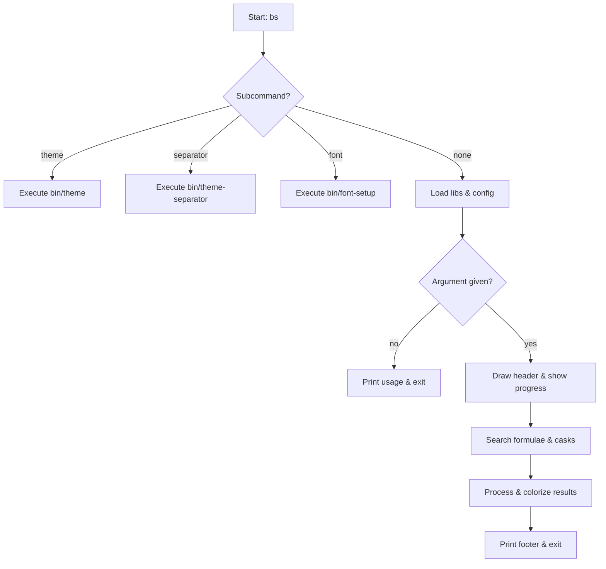

# BrewSearch Command-Line Utility

BrewSearch is a Bash-based wrapper around Homebrew’s search functionality. It provides:

- 🔍 **Unified Search** for both formulae (CLI tools) and casks (GUI apps)
- 📊 **Real-time Progress Indicators** with smooth, multi-color gradients
- 📋 **Formatted Output** featuring headers, separators, and color-highlighted package info
- ⚙️ **Modular Subcommands** for theme, separator, and font setup
- ⚙️ **Configurable Defaults** via `config/defaults.conf`

---

## 1. Main Script: `bin/brewsearch`

### Overview

The `brewsearch` script orchestrates the search workflow: resolving its actual location, handling subcommands, loading libraries, performing searches, and rendering results .

### Symlink Resolution

At startup, BrewSearch determines its real directory—following symlinks—to correctly locate libraries and config files:

```bash
SOURCE="${BASH_SOURCE[0]}"
while [ -h "$SOURCE" ]; do
  SCRIPT_DIR="$(cd -P "$(dirname "$SOURCE")" && pwd)"
  SOURCE="$(readlink "$SOURCE")"
  [[ $SOURCE != /* ]] && SOURCE="$SCRIPT_DIR/$SOURCE"
done
SCRIPT_DIR="$(cd -P "$(dirname "$SOURCE")" && pwd)"
PROJECT_ROOT="$(dirname "$SCRIPT_DIR")"
```


Copy And Save


Share


Ask Copilot


This ensures that invoking `bs` via `~/.local/bin/bs` still finds `lib/` and `config/` in the project root .

### Subcommands

Before entering the search flow, `brewsearch` checks for special subcommands:

| Subcommand | Action |
| --- | --- |
| `bs theme` | Launches `bin/theme` selector |
| `bs separator` | Launches `bin/theme-separator` selector |
| `bs font` | Launches `bin/font-setup` wizard |


### Library Imports

The script sources four reusable libraries under `lib/`:

- **colors.sh** – ANSI palette, badges, boxes
- **progress.sh** – gradient progress bar functions
- **search.sh** – formula and cask search wrappers
- **format.sh** – section headers and separators

### Argument Validation & Usage

If no package name is provided, BrewSearch prints usage guidance with examples and exits:

```bash
echo -e "${COLOR_ERROR}Usage: bs [ARGUMENT]${NC}"  
echo -e "${COLOR_INFO} bs theme [theme-name|number]${NC}"
...
exit 1
```


Copy And Save


Share


Ask Copilot


### Search Workflow

1. **Header**: Displays a boxed title.
2. **Progress Steps**:
3. 0/4 Starting
4. 1/4 Searching formulae
5. 2/4 Searching casks
6. 3/4 Gathering info
7. 4/4 Complete
8. **Fetch Results** with `search_formulae` and `search_casks` functions.
9. **Count & Summarize** results; warn if none found.
10. **Display Formulae & Casks**:
11. Batch `brew info` calls for performance
12. Colorize each line via `highlight_package_line`
13. Insert custom separators between entries .

### Footer

Draws a horizontal separator and prints a completion message with totals.

### Execution Flow Diagram



---

## 2. Configuration: `config/defaults.conf`

BrewSearch reads default settings if present. A typical `defaults.conf` defines:

| Variable | Description | Example |
| --- | --- | --- |
| `PROGRESS_BAR_LENGTH` | Number of segments in progress bar | `20` |
| `PROGRESS_UPDATE_DELAY` | Delay between progress updates (s) | `0.5` |
| `SHOW_SEPARATORS` | Toggle result separators | `true` |
| `SEPARATOR_STYLE` | Pattern used between entries | `***───…───***` |


These values can be overridden by subcommands like `bs theme` or `bs separator` .

---

## 3. Libraries

### 3.1 `lib/colors.sh`

Manages a 6-color ANSI palette. It loads theme definitions from `defaults.conf` if available; otherwise, applies a hard-coded purple/pink/cyan scheme. Provides variables like:

- `COLOR_SUCCESS`, `COLOR_ERROR`, `COLOR_INFO`
- `draw_box(text,color)`
- `print_badge(status,text)`

### 3.2 `lib/progress.sh`

Wraps gradient progress bar functionality:

```bash
show_progress() { draw_progress_bar "$1" "$2" "$3"; }
clear_progress() { echo -e "\n"; }
```


Copy And Save


Share


Ask Copilot


`draw_progress_bar` interpolates 6 colors for smooth transitions.

### 3.3 `lib/search.sh`

Defines simple search functions:

```bash
search_formulae() { brew search --formula "$1" | grep -E '^[[:alnum:]_-]+$'; }
search_casks()   { brew search --cask   "$1" | grep -E '^[[:alnum:]_-]+$'; }
```


Copy And Save


Share


Ask Copilot


### 3.4 `lib/format.sh`

Handles result formatting:

- `print_section_header title`
- `print_result_separator`

---

## 4. Installation & Requirements

### 4.1 `bin/check-requirements`

Validates system prerequisites:

- **Bash ≥ 4.0** (macOS default is 3.2)
- **Homebrew** CLI
- Optional managers: `mise`, `uv`
- Existence of `.env` with `EXA_API_KEY`

Prints colored statuses and guidance .

### 4.2 `bin/install`

Interactive installer that:

- Creates `~/.local/bin`
- Manages the `bs` symlink to `bin/brewsearch`
- Verifies `$PATH` inclusion
- Provides clear, colorized feedback .

---

## 5. Testing

A minimal automated test verifies search functions:

```bash
# tests/test_search.sh
source "$(dirname "$0")/../lib/search.sh"
result=$(search_formulae "redis")
if [ -n "$result" ]; then echo "✓ search_formulae works"; else echo "✗ search_formulae failed"; fi
```


Copy And Save


Share


Ask Copilot


Run with `bash tests/test_search.sh` .

---

## 6. Usage Examples

```bash
# Search for Redis
bs redis

# List available themes
bs theme

# Apply “Dracula” theme
bs theme dracula

# List separator styles
bs separator

# Apply wave separator (style 5)
bs separator 5

# Launch Nerd Font setup wizard
bs font
```


Copy And Save


Share


Ask Copilot


---

### Card: Key Takeaway

```card
{
    "title": "Modular Design",
    "content": "BrewSearch splits core logic into small libraries for colors, progress, search, and formatting."
}
```

BrewSearch offers a sleek, extensible interface for Homebrew package discovery, combining colorized output, smooth progress bars, and user-friendly customization. Enjoy faster, prettier searches!