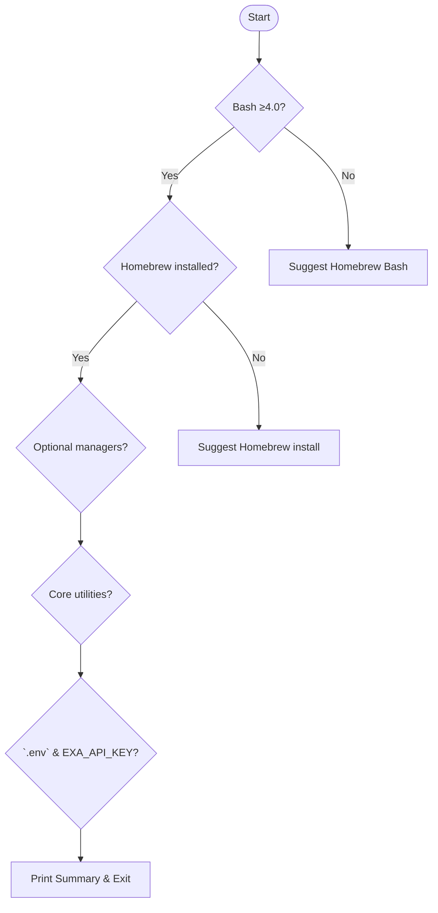

# bin/check-requirements

## 🚀 Overview

The `**bin/check-requirements**` script verifies that your system meets all prerequisites for running **BrewSearch**, the Homebrew-search utility. It checks core dependencies (Bash, Homebrew), optional tools (package managers), essential utilities, and your project configuration (`.env` file). Finally, it summarizes missing requirements and provides actionable installation hints.

---

## 🛠️ Setup & Execution

Run the script from your project root:

```bash
cd /path/to/brewsearch
./bin/check-requirements
```


Copy And Save


Share


Ask Copilot


Copy And Save


Share


Ask Copilot


- Ensure the script is executable:

```bash
  chmod +x bin/check-requirements
```


Copy And Save


Share


Ask Copilot


Copy And Save


Share


Ask Copilot


- If missing, adjust permissions or call with `bash`:

```bash
  bash ./bin/check-requirements
```


Copy And Save


Share


Ask Copilot


Copy And Save


Share


Ask Copilot


---

## :mag: What It Checks

| Check | Requirement | Statuses |
| --- | --- | --- |
| **Bash version** | ≥ 4.0 | ok / missing |
| **Homebrew** | Installed | ok / missing |
| **Optional package manager** | *mise* or *uv* | ok / warning |
| **Core utilities** | `grep`, `xargs` | ok / missing |
| **Project configuration** | `.env` + `EXA_API_KEY` | ok / warning / missing |


---

## :jigsaw: Key Functions

The script defines two helper functions:

```bash
# Check if a command exists in PATH
command_exists() {
  command -v "$1" >/dev/null 2>&1
}

# Print a message based on status
print_status() {
  local status=$1
  local message=$2

  if [ "$status" = "ok" ]; then
    print_success "$message"
  elif [ "$status" = "missing" ]; then
    print_error "$message"
    ((MISSING_COUNT++))
  elif [ "$status" = "warning" ]; then
    print_warning "$message"
  else
    print_info "$message"
  fi
}
```


Copy And Save


Share


Ask Copilot


Copy And Save


Share


Ask Copilot


- `command_exists`: Detects whether a given tool (e.g., `brew`, `mise`) is available in the user’s `PATH`.
- `print_status`: Delegates messages to colored output functions (from `lib/colors.sh`), while tracking missing dependencies.

---

## :mag: Detailed Check Flow



---

## :clipboard: Check Breakdown

### 1. Bash Version

- Uses the running interpreter (`$BASH_VERSION`).
- If `< 4.0`, suggests installing Bash via Homebrew or switching your login shell.

### 2. Homebrew

- Verifies `brew` command.
- If missing, prints install command and the official URL (`https://brew.sh`).

### 3. Optional Package Managers

- Checks `mise` (recommended) and `uv` (alternative).
- Warns if neither is present; displays install snippets for both.

> ```bash # For mise (recommended) curl https://mise.run | sh # For uv curl -LsSf https://astral.sh/uv/install.sh | sh ```

### 4. Core Utilities

- Confirms availability of `grep` and `xargs`.
- Flags missing ones as **critical** (since they’re used extensively in the search logic).

### 5. Configuration (`.env`)

- Checks existence of project’s `.env` file.
- Looks for `EXA_API_KEY`.
- **Warning** if placeholder value remains.
- **Missing** if key is absent.

---

## :check_mark_button: Summary & Exit Codes

At the end, the script prints a summary box:

- **All clear** (`exit 0`): All **required** checks passed.
- **Errors** (`exit 1`): One or more requirements **missing**.

Depending on the outcome, it suggests:

- How to invoke `./bin/brewsearch` (with the correct Bash if necessary).
- Creating a symlink for convenience:

```bash
  ln -s "$(pwd)/bin/brewsearch" ~/.local/bin/bs
```


Copy And Save


Share


Ask Copilot


Copy And Save


Share


Ask Copilot


---

## 💡 Best Practices

```card
{
    "title": "Configure EXA_API_KEY",
    "content": "Copy .env.example \u2192 .env and replace EXA_API_KEY placeholder with your actual API key."
}
```

- **Always** keep your `.env` file out of version control.
- **Update** your shell’s login file if you install a new Bash via Homebrew.
- **Run** this checker after any major environment change.

---

## 📖 References

- Colorized output and helper functions are defined in `lib/colors.sh` (sourced at runtime).
- For more in-depth setup, see the [Installation Guide](docs/INSTALLATION.md) and [Bash Version Compatibility](docs/BASH_VERSION.md).